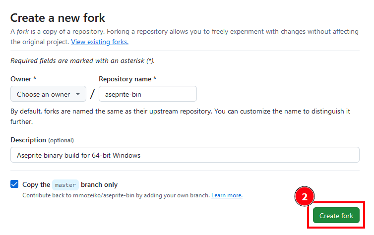
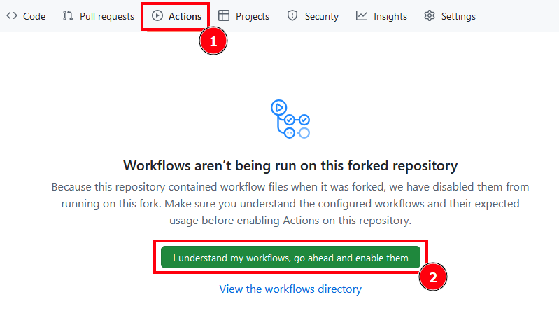
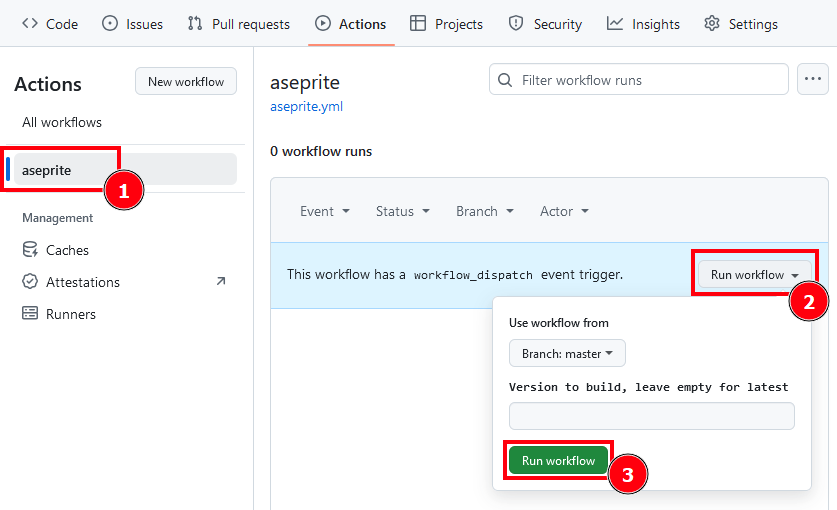
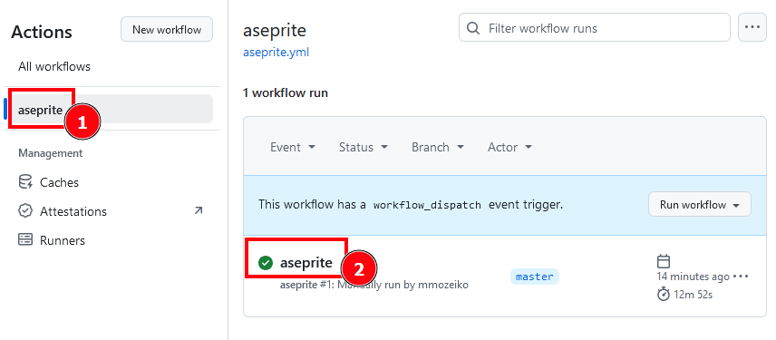
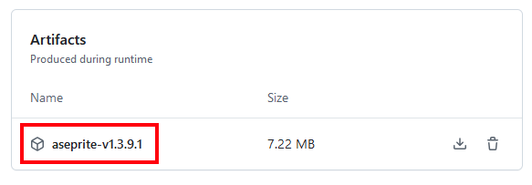

[Aseprite][] binary build for 64-bit Windows.

Step by step guide to build binaries for latest version:

# 1. Create fork by clicking `Fork` button on the top right

# 2. Click `Actions` tab on the top, and enable actions

# 3. Open `aseprite` workflow, and click `Run workflow`

Optionally specify which version of Asprite to build (e.g. v1.3.10) in text field.
Leave it empty to build latest released version.
See list of available Aseprite versions [here][versions].

# 4. Wait ~13min for build to finish, then open latest run

# 5. Scroll to the bottom to download .zip archive

For building newer aseprite version repeat steps 3 to 5.

[Aseprite]: https://github.com/aseprite/aseprite
[versions]: https://github.com/aseprite/aseprite/tags
